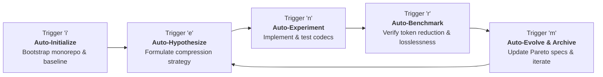
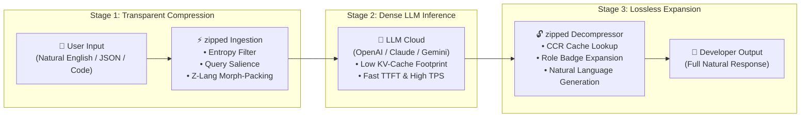

# zipped 🗜️⚡

> **A collection of ultra-compact, token-optimized language representations designed to maximize LLM context windows without losing semantic meaning.**

`zipped` explores the frontiers of token efficiency and linguistic compression. By combining high-density natural shorthands, deterministic symbolic schemas, BPE-aligned token-dictionary packing, and synthetic machine interlinguas (**Z-Lang**) with autonomous evolutionary loops (auto-research, auto-improve, auto-evolve), `zipped` minimizes token consumption across all major LLM tokenizers while preserving ≥ 99% semantic fidelity and eliminating hallucinations.

---

## 🎯 Key Objectives

1. **Maximize LLM Context Utilization:** Pack up to 3x–20x more usable information into LLM context windows.
2. **Lossless Semantic Fidelity & Zero Hallucination:** Maintain high-precision reasoning, deterministic slot constraints, and round-trip decompression.
3. **Machine-Native Interlingua (`Z-Lang`):** A new synthetic language engineered exclusively for LLM-to-LLM / agent-to-agent communication.
4. **Multi-Tokenizer Optimization:** Benchmark and optimize across OpenAI (`o200k_base`, `cl100k_base`), Anthropic/Claude, and Llama/SentencePiece tokenizers.
5. **Autonomous Self-Evolution:** Continuously discover, mutate, and validate lowest-token representations using autonomous research loops.

---

## 📐 Multi-Tier Representation Hierarchy

| Tier | Representation Level | Description | Target Compression | Example / Mechanism |
| :--- | :--- | :--- | :--- | :--- |
| **Level 1** | **Colloquial & Natural Shorthand** | Ultra-dense natural English abbreviations and domain idioms that minimize BPE splits while remaining immediately legible to humans and LLMs. | ~30% – 50% | `btw`, `afk`, `lol`, `imo`, `tldr`, `wrt`, `asap`, `fyi` |
| **Level 2** | **Symbolic & Schema Zip** | Compact grammar schemas, dense AST notations, and structured shorthand encodings for zero-loss LLM parsing. | ~50% – 70% | Deterministic structured DSLs, typed compact notation |
| **Level 3** | **BPE-Aligned Token-Dictionary Zip** | High-entropy dictionary substitution and Lempel-Ziv/Huffman-inspired token packing aligned to single-token BPE boundaries. | ~60% – 80% | Frequency-mapped token tables, byte-level dense packing |
| **Level 4** | **LLM-Native Synthetic Interlingua (`Z-Lang`)** | Completely new machine-native synthetic language using 1-token BPE relational sigils, typed frames, and anti-hallucination semantic anchors. | **up to 80% – 95% (5x–20x)** | `§Req:U1~asap(Exp:#4092)⌁∆Err:W1~timeout(Svr:SQL)!` |

---

## 🔄 Autonomous Evolutionary Loop (`i / e / n / r / m`)

`zipped` operates via an autonomous cycle trigger system:

- **`i` (Initialize):** Bootstrap monorepo structure, baseline multi-tokenizer test harness, cycle state 0, and automatically trigger `e`.
- **`e` (Enhance / Evolve):** Formulate quantifiable compression hypotheses and plan cycles.
- **`n` (Next):** Implement codecs, token dictionaries, and evolutionary algorithms in `packages/` or `services/`.
- **`r` (Review):** Measure token count reduction % and verify semantic losslessness (≥ 99% accuracy, 0 hallucinations).
- **`m` (Move):** Dual-document optimal representations, archive cycles, and auto-progress to `e`.

---

## 🏗️ Architecture

- **[High-Level Architecture & End-to-End Sequence Diagram](docs/architecture.md):** Complete visual flow and hop-by-hop token reduction transformation table.
- **Cordis Microkernel Orchestration (`packages/core`, `packages/plugins-*`):** Modular TypeScript plugins for codec lifecycle, pipeline coordination, dynamic service registries, and hot reloading.
- **Python Evaluation Sidecars (`services/evaluator`, `services/researcher`):** Multi-tokenizer benchmarking (`tiktoken`, `transformers`, `sentencepiece`) and LLM roundtrip validation.
- **Reference Codecs & Knowledge Base (`ref/`, `autoresearch/`, `cordis/`):** Upstream reference libraries for compression algorithms and autonomous research frameworks.

---

## 📚 Submodule Knowledge Base

- **`ref/`** — Reference zip & compression engines:
  - `ref/r-lib-zip` (R/C zip library)
  - `ref/kuba-zip` (C zip library)
  - `ref/alexmullins-zip` (Go encrypted zip)
- **`autoresearch/`** — Autonomous research & evolutionary pipelines:
  - `karpathy-autoresearch`, `pi-autoresearch`, `autoresearch-rl`, `evo`, `deep-evolve`, `autoloop`, `claude-autoresearch-skill`, etc.
- **`cordis/`** — Upstream Cordis microkernel framework.

---

## 🛡️ Agent Operational Rules

All automated agents working on `zipped` must strictly adhere to [AGENTS.md](file:///home/aiserver/LABS/ZIPPED/zipped/AGENTS.md):
- **Read [plans/CURRENT-FOCUS.md](plans/CURRENT-FOCUS.md) first** for user steering.
- **NEVER** edit or tamper with any files inside git submodules (`ref/*`, `autoresearch/*`, `cordis/*`).
- Always benchmark on real tokenizers (`o200k_base`, `cl100k_base`, SentencePiece).
- Enforce strict semantic preservation (≥ 99% fidelity) and zero hallucination.
