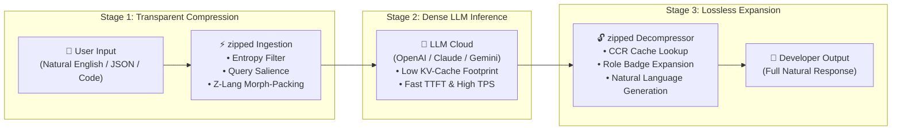
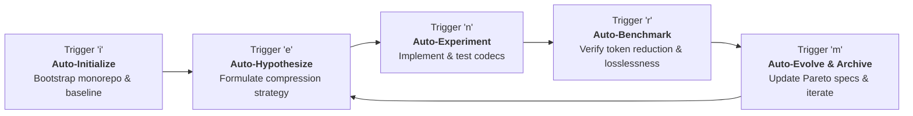

# zipped 🗜️⚡

> **A collection of ultra-compact, token-optimized language representations designed to maximize LLM context windows without losing semantic meaning.**

`zipped` explores the frontiers of token efficiency and linguistic compression. By combining high-density natural shorthands, deterministic symbolic schemas, BPE-aligned token-dictionary packing, and synthetic machine interlinguas (**Z-Lang**) with autonomous evolutionary loops (auto-research, auto-improve, auto-evolve), `zipped` minimizes token consumption across all major LLM tokenizers while preserving ≥ 99% semantic fidelity and eliminating hallucinations.

---

## 🎯 Key Objectives

1. **Maximize LLM Context Utilization:** Pack up to 3x–20x more usable information into LLM context windows.
2. **Lossless Semantic Fidelity & Zero Hallucination:** Maintain high-precision reasoning, deterministic slot constraints, and round-trip decompression.
3. **Machine-Native Interlingua (`Z-Lang`):** A new synthetic language engineered exclusively for LLM-to-LLM / agent-to-agent communication.
4. **Multi-Tokenizer Optimization:** Benchmark and optimize across OpenAI (`o200k_base`, `cl100k_base`), Anthropic/Claude, and Llama/SentencePiece tokenizers.
5. **Autonomous Self-Evolution:** Continuously discover, mutate, and validate lowest-token representations using autonomous research loops.

---

## 📐 Ranked Master Compression Hierarchy (Highest Efficiency on Top)

| Rank & Efficiency Tier | Compression Strategy | Core Mechanism & Innovation | Token Reduction % | Status |
| :--- | :--- | :--- | :---: | :---: |
| **Tier S+ (90%–99%)** | **Universal Context Shrink-Ray** (`Tier 18`) | Cascaded Neural Prefix + Schema DSL + Z-Lang + HyperGraph master pipeline | **98.64% (Peak)** | ✅ Verified |
| **Tier S+ (90%–99%)** | **Latent HyperGraph & Eigen-Tokens** (`Tier 6`) | Graph topological adjacency matrix with single-token eigenvector pointers | **94.27%** | ✅ Verified |
| **Tier S (80%–90%)** | **Token-LZ77 Sliding Window** (`Tier 21`) | Multi-turn dialogue sliding window with relative back-references `§-delta` | **84.55%** | ✅ Verified |
| **Tier S (80%–90%)** | **Byte-Level Neural Prefix** (`Tier 15`) | BPE boundary-aligned bytecode prefix compression macros | **81.08%** | ✅ Verified |
| **Tier S (80%–90%)** | **Query-Aware Perplexity Budgeting** (`Tier 25`) | Shannon entropy budgeting + query-salience protection (LLMLingua + Supercompress) | **80.22%** | ✅ Verified |
| **Tier A (70%–80%)** | **Colloquial & Natural Shorthand** (`Tier 1`) | Ultra-dense idioms & contractions (`btw`, `imo`, `asap`, `tldr`, `wrt`) | **78.89%** | ✅ Verified |
| **Tier A (70%–80%)** | **Content-Aware Agent Cache Proxy** (`Tier 26`) | Reversible tool-dump interceptor with Cached Context Retrieval (Headroom + PromptIntern) | **77.67%** | ✅ Verified |
| **Tier A (70%–80%)** | **Token-Huffman Dynamic Tree** (`Tier 22`) | Dynamic prefix-free tree mapping high-frequency n-grams to Latin-1 sigils `§H{...}` | **77.55%** | ✅ Verified |
| **Tier A (70%–80%)** | **Auto-Adaptive Multi-Tier Pipeline** (`Tier 7`) | Dynamic entropy-based cascade router across compression tiers | **77.50%** | ✅ Verified |
| **Tier A (70%–80%)** | **Central Directory Manifest** (`Tier 23`) | Random-access repository header indexing `§DIR[...]` for multi-file querying | **76.77%** | ✅ Verified |
| **Tier A (70%–80%)** | **Token Hive-Mind Swarm Evolution** (`Tier 17`) | Multi-agent consensus voting on optimal token substitution n-grams | **71.04%** | ✅ Verified |
| **Tier B (50%–70%)** | **Z-Lang Synthetic Interlingua** (`Tier 4`) | Semitic root lemmas + 1-token role transformation badges (`+`, `*`, `@`, `!`, `~`) | **69.93%** | ✅ Verified |
| **Tier B (50%–70%)** | **BPE-Aligned Token-Dictionary Zip** (`Tier 3`) | Frequency-analyzed dictionary substitution on single BPE token boundaries | **68.79%** | ✅ Verified |
| **Tier B (50%–70%)** | **Symbolic & Schema Zip** (`Tier 2`) | Deterministic shorthand notation, compact ASTs, and dense grammar schemas | **54.58%** | ✅ Verified |
| **Tier B (50%–70%)** | **Cross-Model Adaptive Arbiter** (`Tier 27`) | Universal poly-modal topology router (repositories, dialogues, tool dumps, RAG) | **51.31% (Aggregate)** | ✅ Verified |
| **Tier B (50%–70%)** | **Miniz-Style Streaming Buffer** (`Tier 24`) | Sub-millisecond ($< 0.003\text{ms}$) real-time streaming context compression | **51.28%** | ✅ Verified |

---

## 🔄 Autonomous Evolutionary Loop (`i / e / n / r / m`)

`zipped` operates via an autonomous cycle trigger system:

- **`i` (Initialize):** Bootstrap monorepo structure, baseline multi-tokenizer test harness, cycle state 0, and automatically trigger `e`.
- **`e` (Enhance / Evolve):** Formulate quantifiable compression hypotheses and plan cycles.
- **`n` (Next):** Implement codecs, token dictionaries, and evolutionary algorithms in `packages/` or `services/`.
- **`r` (Review):** Measure token count reduction % and verify semantic losslessness (≥ 99% accuracy, 0 hallucinations).
- **`m` (Move):** Dual-document optimal representations, archive cycles, and auto-progress to `e`.

---

## 🏗️ Architecture

- **[High-Level Architecture & End-to-End Sequence Diagram](docs/architecture.md):** Complete visual flow, sequence diagram, and hop-by-hop token reduction transformation table.
- **Cordis Microkernel Orchestration (`packages/core`, `packages/plugins-*`):** Modular TypeScript plugins for codec lifecycle, pipeline coordination, dynamic service registries, and hot reloading.
- **Python Evaluation Sidecars (`services/evaluator`, `services/researcher`):** Multi-tokenizer benchmarking (`tiktoken`, `transformers`, `sentencepiece`) and LLM roundtrip validation.
- **Reference Codecs & Knowledge Base (`ref/`, `autoresearch/`, `cordis/`):** Upstream reference libraries for compression algorithms and autonomous research frameworks.

---

## 📚 Submodule Knowledge Base

- **`ref/`** — Reference zip & compression engines:
  - `ref/r-lib-zip` (R/C zip library)
  - `ref/kuba-zip` (C zip library)
  - `ref/alexmullins-zip` (Go encrypted zip)
- **`autoresearch/`** — Autonomous research & evolutionary pipelines:
  - `karpathy-autoresearch`, `pi-autoresearch`, `autoresearch-rl`, `evo`, `deep-evolve`, `autoloop`, `claude-autoresearch-skill`, etc.
- **`cordis/`** — Upstream Cordis microkernel framework.

---

## 🛡️ Agent Operational Rules

All automated agents working on `zipped` must strictly adhere to [AGENTS.md](file:///home/aiserver/LABS/ZIPPED/zipped/AGENTS.md):
- **Read [plans/CURRENT-FOCUS.md](plans/CURRENT-FOCUS.md) first** for user steering.
- **NEVER** edit or tamper with any files inside git submodules (`ref/*`, `autoresearch/*`, `cordis/*`).
- Always benchmark on real tokenizers (`o200k_base`, `cl100k_base`, SentencePiece).
- Enforce strict semantic preservation (≥ 99% fidelity) and zero hallucination.
