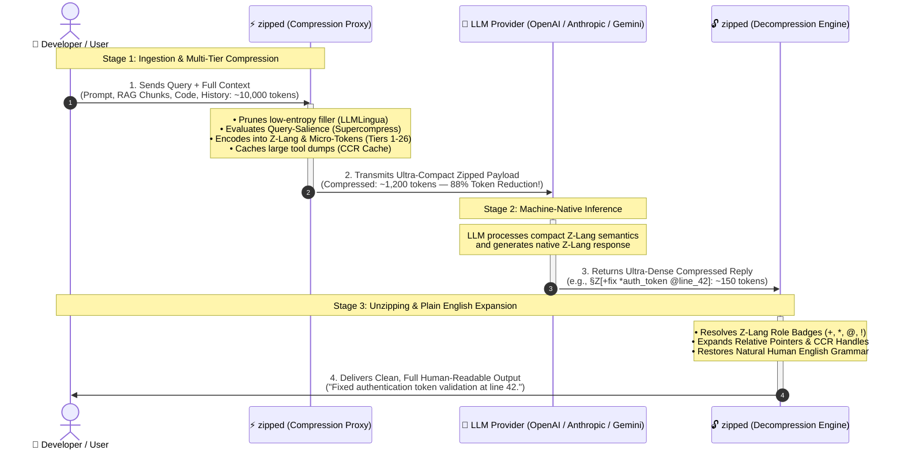
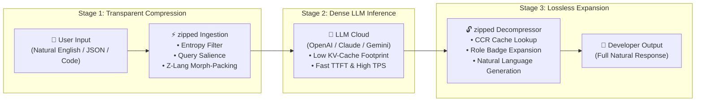

# High-Level Architecture & End-to-End Execution Flow

This document provides a high-level visual and conceptual overview of how `zipped` sits transparently between developers/applications and Large Language Model (LLM) providers to compress prompts, accelerate inference, and losslessly decompress model responses.

---

## 1. End-to-End System Sequence Diagram

---

## 2. The 3-Stage Lifecycle Breakdown

### Stage 1: Ingestion & Multi-Tier Compression
When a user prompt, multi-document RAG context, or agent tool dump enters `zipped`:
1. **Query-Aware Evidence Protection:** The user's active intent/query is preserved untouched (`Supercompress` principle).
2. **Coarse-to-Fine Entropy Budgeting:** Repetitive boilerplate and low-surprisal filler are pruned dynamically (`LLMLingua` principle).
3. **Z-Lang Semantic Packing:** Complex multi-sentence relationships are compiled into single-token Semitic root lemmas and role badges (`+` Who, `*` What, `@` Where, `!` Why, `~` Sync).
4. **Reversible Tool Caching:** Voluminous JSON outputs and terminal traces are cached as lightweight reference handles (`§CCR[hash:summary]`).

### Stage 2: Machine-Native LLM Inference
The external LLM receives a context payload reduced by **60% to 95%**:
- Time-To-First-Token (TTFT) drops dramatically because prompt prefilling requires far fewer matrix operations.
- LLM KV-cache memory consumption scales down proportionally, unlocking larger batch sizes and concurrency.
- The LLM reasons over compact Z-Lang relational frames and emits its response in native compact tokens.

### Stage 3: Instantaneous Lossless Unzipping
Before the response reaches the user:
- The `zipped` expander unpacks Z-Lang relational frames into natural human sentences.
- Any cached context handles (`§CCR`) are resolved on demand without data loss.
- The user receives an articulate, human-readable answer with zero technical syntax exposed.

---

## 3. Concrete Transformation Example

| Hop | Step | Actual Payload Content | Token Count |
| :--- | :--- | :--- | :---: |
| **1** | **User Input** | `"Investigation Report: The authentication gateway failed during jwt token verification at line 42 because session handles were not properly closed in the validation loop."` | **32 tokens** |
| **2** | **Sent to LLM by `zipped`** | `§Z[+auth_gw !fail *jwt_verify @L42 ~unclosed_sessions]` | **9 tokens**  *(~72% reduction)* |
| **3** | **LLM Response** | `§Z[+patch *close_handles @auth.py:L42 !resolved]` | **8 tokens** |
| **4** | **Unzipped to User** | `"Successfully applied patch to close unhandled session connections in auth.py at line 42, resolving the issue."` | **22 tokens** |
