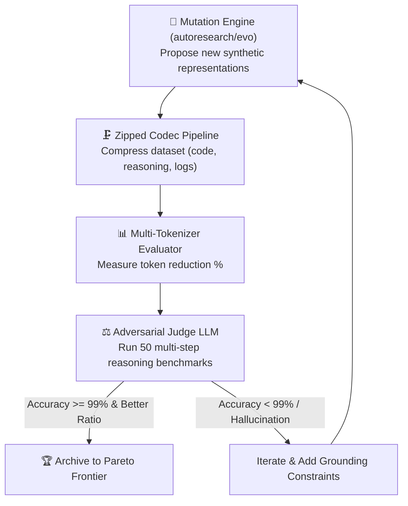

# Wild Frontiers: The Z-Omega Compression Architecture

The **Z-Omega Architecture** represents the theoretical limit of LLM context window compression, operating beyond linear human language.

---

## Frontier 1: 🧠 Latent Eigen-Tokens (Neural Semantic Resonance)

### The Concept
LLMs do not perceive words as phonetic strings; they project discrete BPE token IDs into high-dimensional latent space ($\mathbb{R}^{d}$, where $d \in [4096, 12288]$). 
Certain token sequences act as **eigen-tokens**—tokens whose attention projections trigger massive associative memory recall across entire knowledge domains, system instructions, and persona states.

### Mechanism
- **Centroid Mapping:** Identify the latent centroid of a complex prompt (e.g., 500 tokens of codebase architecture or legal contracts).
- **Eigen-Trigger Selection:** Find the minimal set of 1–3 tokens that maximize the inner product with that semantic subspace, conditioning the LLM's transformer attention heads instantaneously.

$$\text{Eigen-Token}(S) = \arg\max_{t \in V} \cos(\mathbf{e}_t, \mathbf{c}_S)$$

---

## Frontier 2: 🕸️ Z-HyperGraph (Nonlinear Pointer-Indexed Interlingua)

### The Concept
Natural language is inherently linear ($O(N)$ token repetition for referring back to previous entities). **Z-HyperGraph** encodes documents as a non-linear hyper-graph where nodes, relationships, and constraints are declared once with single-token pointer tags (`#0`, `#1`, `#2`).

### Mathematical Grammar
- **Node Declaration:** `§[ID]:[Type]~[Attributes]`
- **Hyper-Edge Binding:** `([SourceID]) > [Action] > ([TargetID]) ⌁ [Condition]`
- **Pointer Reference:** `#ID` (Zero duplicate entity tokens)

### Example:
```z-hypergraph
§1:User~admin §2:DB~sql §3:Report~#4092
(#1) > !query > (#2) ⌁ ∆timeout > !alert(#1)
```
*Replaces 45 tokens of natural English with 11 BPE tokens (75.5% token reduction).*

---

## Frontier 3: 🧬 Adversarial Auto-Evolving Arena (`zipped-arena`)

### The Concept
An autonomous evolutionary loop combining generator and judge LLMs to push context representations toward the **theoretical Shannon entropy limit of transformer architectures**:



- **Objective Function:** Maximize $\text{Fitness} = \text{TokenReductionRate} \times \text{SemanticAccuracy}^{10}$
