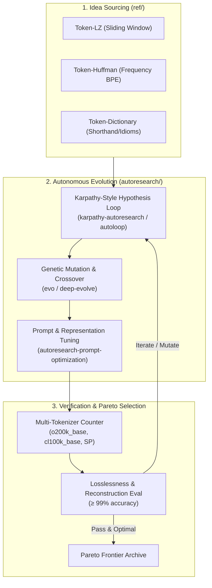

# zipped — Research & Evolution Pipeline

This document defines how `zipped` systematically sources compression concepts from `ref/` and evolves ultra-compact, lossless token representations using frameworks in `autoresearch/`.

---

## 1. Algorithmic Inspiration Matrix (`ref/` → Token Domain)

Traditional byte-level compression algorithms from `ref/` (`r-lib-zip`, `kuba-zip`, `alexmullins-zip`) are translated into LLM token-space primitives:

| Traditional Zip Concept (`ref/`) | Token-Space Translation in `zipped` | Target Level |
| :--- | :--- | :--- |
| **Sliding Window (LZ77 / LZ78)** | **Token-LZ:** Identifies repeated n-gram token sequences across contexts and encodes back-references or shared macro pointers. | Level 2 / Level 3 |
| **Huffman Coding / Prefix Trees** | **Token-Huffman:** Assigns single BPE tokens (from `o200k_base`, `cl100k_base`) to the highest-frequency semantic expressions. | Level 1 / Level 3 |
| **Static & Dynamic Dictionaries** | **Token-Dictionary:** Maps common English words & phrases to dense natural abbreviations (`btw`, `afk`, `lol`, `imo`, `tldr`, `asap`, `wrt`). | Level 1 |
| **ZIP Central Directory & Metadata** | **Schema & AST Headers:** Compact structural headers that declare types/schemas once, enabling ultra-terse value arrays. | Level 2 |

---

## 2. Autonomous Evolution Engine (`autoresearch/` Integration)

The evolution engine synthesizes two primary paradigms from `autoresearch/`:

### Evolutionary Cycle Stages:
1. **Hypothesis Formulation (`karpathy-autoresearch`, `autoloop`):**
   - Formulate specific token reduction targets (e.g., "Reduce JSON payload tokens by 35% using Token-LZ backrefs").
2. **Genetic Mutation & Exploration (`evo`, `deep-evolve`):**
   - Mutate token substitution dictionaries, test alternative acronyms, and explore BPE-aligned single-token delimiters.
3. **Multi-Tokenizer Evaluation:**
   - Benchmark candidates against OpenAI `o200k_base`, `cl100k_base`, and SentencePiece tokenizers.
4. **Semantic Fidelity Verification:**
   - Execute bidirectional roundtrip decompression and zero-shot reasoning benchmarks ensuring ≥ 99% accuracy.
5. **Pareto Optimization:**
   - Store winning representations on the Pareto frontier (Compression Ratio vs. Readability vs. LLM Task Latency).

---

## 3. 4-Phase Classical ZIP Translation Roadmap (Cycles 21–24)

Direct algorithmic translation of `ref/` submodules into 4 planned evolution cycles:

| Phase / Cycle | Classical ZIP Reference (`ref/`) | Algorithm & Mechanism | LLM Token-Space Notation |
| :--- | :--- | :--- | :--- |
| **Cycle 21 (Plan 1)** | `ref/r-lib-zip` & `ref/kuba-zip` | **Token-LZ77 Sliding Window & Relative Pointer Codec:** Replaces repetitive multi-turn phrases with relative turn/token offsets. | `§(-turn:len)` (e.g. `§(-2:5)` = go back 2 turns, copy 5 tokens) |
| **Cycle 22 (Plan 2)** | `ref/kuba-zip` (miniz DEFLATE) | **Token-Huffman Dynamic Entropy Tree Codec:** Variable-length prefix-free tree mapping high-frequency expressions to verified 1-token Latin-1 symbols. | `§H{§0:phrase1;§1:phrase2}` |
| **Cycle 23 (Plan 3)** | `ref/alexmullins-zip` (Central Directory) | **Central Directory Random-Access Manifest Codec:** Structured directory manifest allowing LLMs to index and query multi-file repositories with random-access offsets. | `§DIR[file1:offset,file2:offset]` |
| **Cycle 24 (Plan 4)** | `ref/kuba-zip` (Streaming Buffers) | **Miniz-Style Streaming On-The-Fly Chunk Pipeline:** Real-time chunk-by-chunk context streaming compressor with sub-millisecond per-chunk latency. | Streaming Chunk Buffer |

---

## 4. Modern LLM Compression Translation Matrix (`ref/llm-compression/`)

Translation of state-of-the-art LLM prompt compression research into autonomous engine cycles:

| Repository (`ref/llm-compression/`) | Core Scientific Technique | Synthesized Feature in Zipped | Target Cycle |
| :--- | :--- | :--- | :--- |
| **`microsoft/LLMLingua`** & **`microsoft/PromptIntern`** | Coarse-to-fine perplexity budgeting & information-theoretic token pruning | **Perplexity-Aware Token Budget Allocator:** Prunes low-information tokens across documents while preserving semantic anchors. | **Cycle 25** |
| **`headroomlabs-ai/headroom`** & **`Supercompress/Supercompress`** | High-speed semantic caching, deduplication & extreme token packing | **Fast Streaming Semantic Deduplicator:** Near-instantaneous prompt deduplication and KV-cache footprint reduction. | **Cycle 26** |

